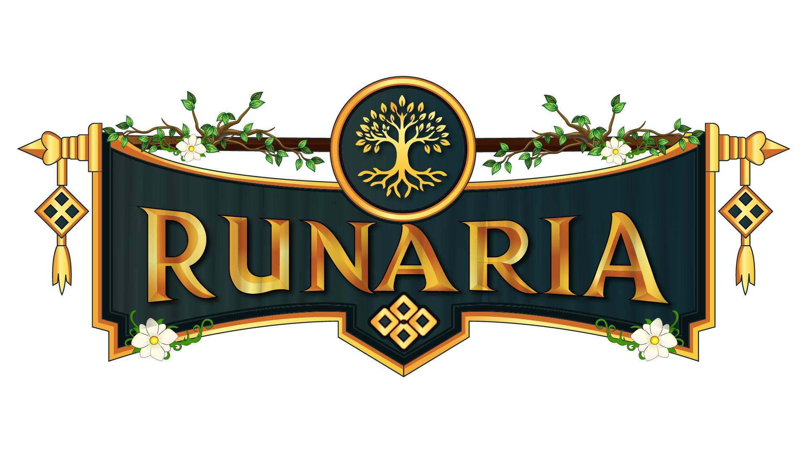

# Runaria Wiki

Everything Runaria adds on top of Minecraft — how each system works, what the commands are, and where to find things. Use the search bar at the top if you already know what you're looking for.

## New here? Start with these

Runaria is a full RPG server. The five systems you'll touch on day one:

- **[Classes](progression/classes.md)** — 44 of them. Pick a base class, promote at level 30, unlock the rest with Class Tokens.
- **[Traits](progression/traits.md)** — permanent passive bonuses you earn just by playing.
- **[Quests](guilds/quests.md)** — a story line that teaches the server, plus a daily quest board and its own shop.
- **[Guilds](guilds/guilds.md)** — free to create, and the gateway to land claims, upgrades, and guild contracts.
- **[Professions](progression/professions.md)** — ten of them, and they level your character too.

## Fighting

| Page | What's in it |
| --- | --- |
| [Dungeons & Parties](adventure/dungeons.md) | What's down there, how parties work, and where to start |
| [Bestiary](adventure/bestiary.md) | What's out there, where it lives, and what's worth killing |
| [Anomaly Zones](adventure/anomaly-zones.md) | Timed zones that buff you — or spawn a boss |
| [Resource Drops](adventure/resource-drops.md) | Meteors, crates, and Grand Drops falling into the world |
| [PvP & Bounties](adventure/pvp.md) | Opt-in rogue PvP and the bounty system |
| [Siege Zones](adventure/siege-zones.md) | Guild-vs-guild control points with loot vaults |

## Making things

| Page | What's in it |
| --- | --- |
| [Crafting Stations](economy/stations.md) | All 21 stations and what each is for |
| [Ores & Materials](economy/materials.md) | 28 custom ores, where to find them, and the rarity ladder |
| [Gems & Enchanting](economy/gems.md) | Socketing gems, and 123 enchant stones |
| [Item Quality](economy/crafting.md) | The Forged-By system and how your profession level shapes gear |
| [Attributes](progression/attributes.md) | The 36 attributes and how to spend points |

## Living in the world

| Page | What's in it |
| --- | --- |
| [Farming & Seasons](lifeskills/farming.md) | 33 crops, the season cycle, and star quality |
| [Cooking & Food](lifeskills/cooking.md) | 30 dishes, and why the cook's level is what matters |
| [The Market](economy/market.md) | Server shop, auction house, and the player economy |
| [Backpacks](economy/backpacks.md) | Portable storage that also buffs you |
| [Bots](automation/bots.md) | Placeable robots that farm, collect, cook, and smelt for you |
| [Living NPCs](world/npcs.md) | NPCs you talk to by typing — they remember you |
| [World Rules & Misc](world/world-rules.md) | Locked dimensions, keys, item timers, Discord linking |

---

*Values on this wiki reflect current server configuration and may be tuned as the server is balanced.*
